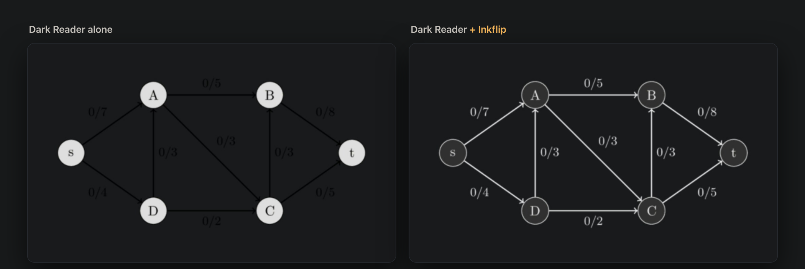
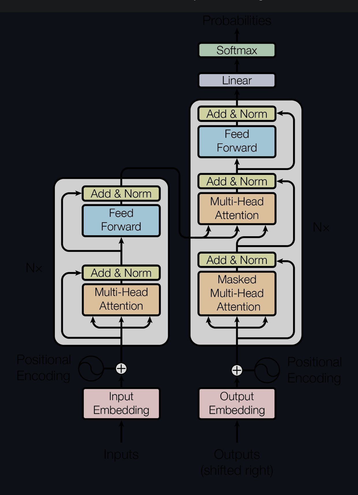
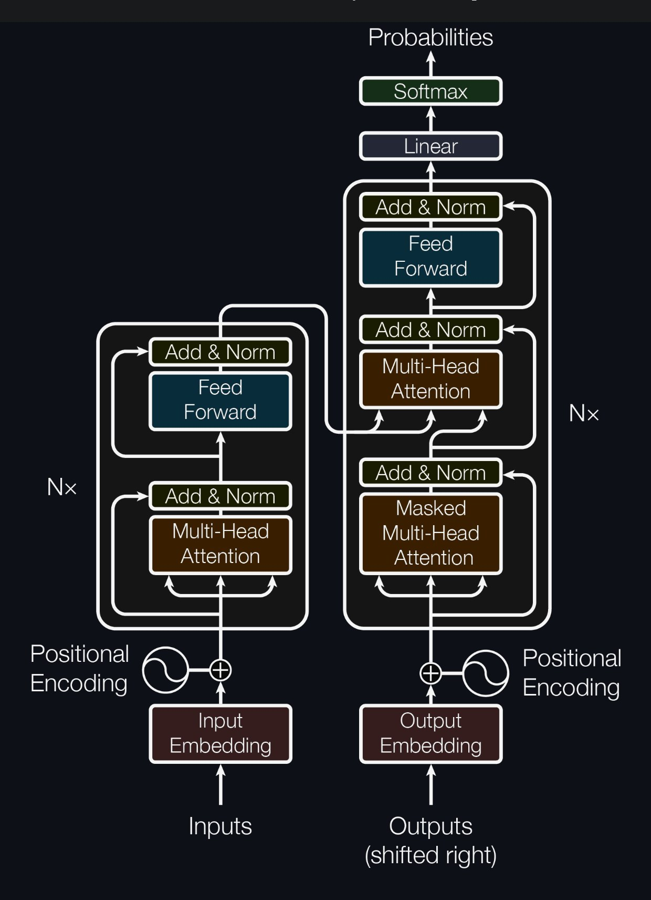
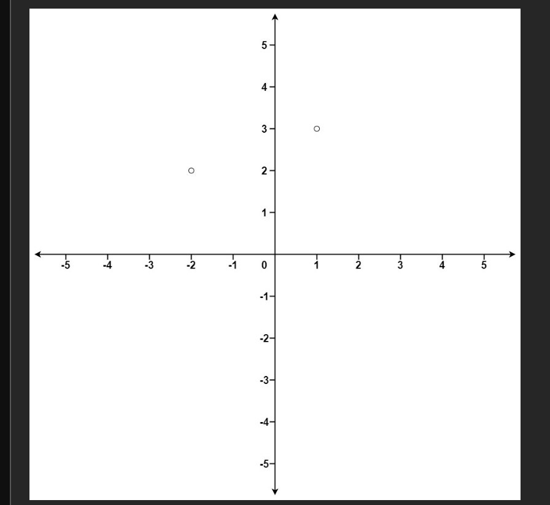
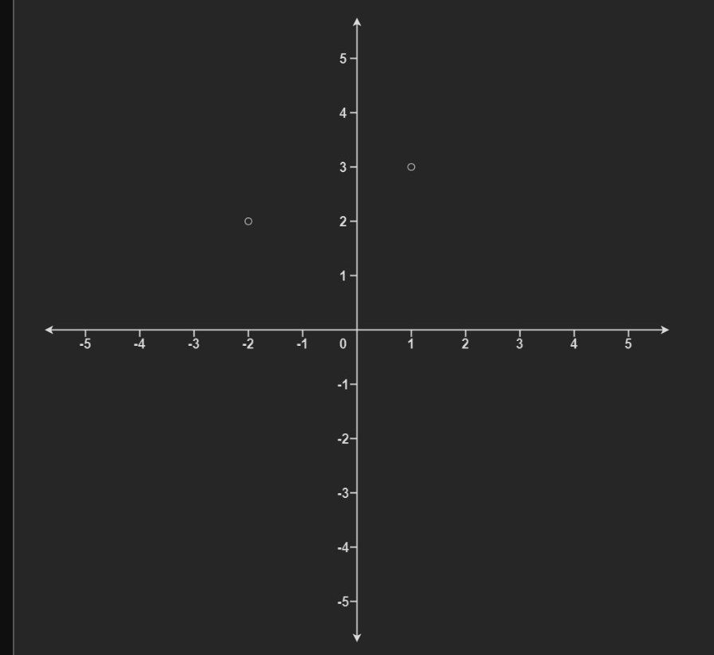
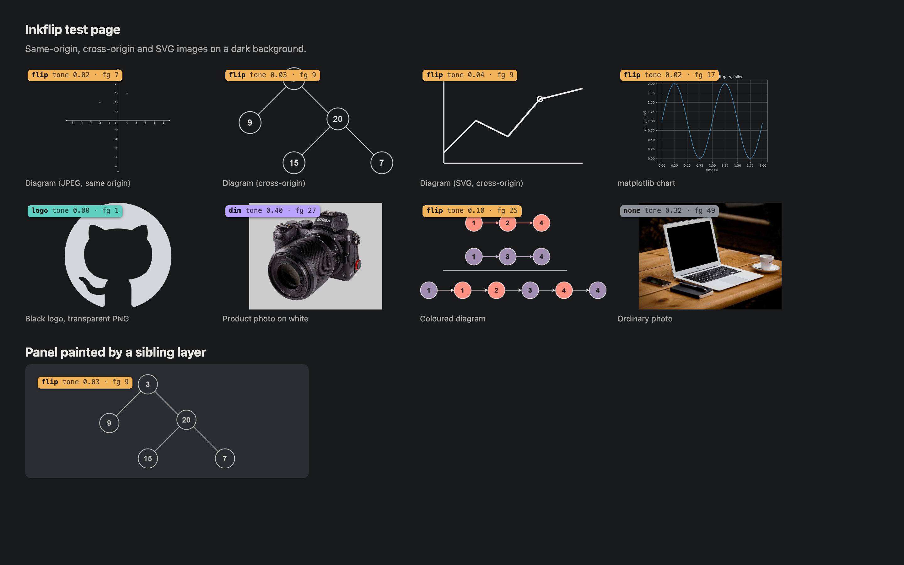

<p align="center">
  
</p>

<h1 align="center">Inkflip</h1>

<p align="center">Dark mode for the images Dark Reader leaves white.</p>

<p align="center">
  <a href="https://inkflip.r-q.name">Website</a> ·
  <a href="https://chromewebstore.google.com/detail/inkflip-dark-mode-for-ima/eoilngdponimjhhfdfahpkfkkhopbfjc">Chrome Web Store</a> ·
  <a href="https://inkflip.r-q.name/privacy">Privacy</a>
</p>



[Dark Reader](https://darkreader.org) recolours text and backgrounds but leaves images as they
are. On a dark page, diagrams and charts drawn on white stay white, and black logos on
transparent backgrounds are hard to see.

Inkflip is a Chrome extension that runs next to Dark Reader. On a dark page it checks each
image and canvas and either flips it, brightens it, dims it or leaves it alone. It never
flips photos. It also darkens white embedded pages, such as live code previews, on sites that
are dark by themselves.

## Before and after

Dark Reader in its default mode, first alone and then with Inkflip.

<table>
  <tr>
    <th width="50%">Dark Reader alone</th>
    <th width="50%">Dark Reader + Inkflip</th>
  </tr>
  <tr>
    <td></td>
    <td></td>
  </tr>
  <tr>
    <td colspan="2">The Transformer figure from <a href="https://arxiv.org/html/1706.03762v7">"Attention Is All You Need"</a>.</td>
  </tr>
  <tr>
    <td></td>
    <td></td>
  </tr>
  <tr>
    <td colspan="2">A black logo in a GitHub README (<a href="https://github.com/cosmos/gravity-bridge/issues/358">issue</a>).</td>
  </tr>
  <tr>
    <td></td>
    <td></td>
  </tr>
  <tr>
    <td colspan="2">The diagram on <a href="https://leetcode.com/problems/k-closest-points-to-origin/">LeetCode 973</a>. Its background takes the colour of the panel behind it.</td>
  </tr>
</table>

More examples are on [the website](https://inkflip.r-q.name).

## What it does

| Verdict | Images | Result |
|---|---|---|
| Flip | Black-on-white diagrams, charts, plots and text screenshots, and transparent diagrams drawn for a white page | Brightness is inverted and hues are kept. The background becomes the colour of the panel behind the image |
| Brighten | Dark logos, formulas and line drawings on a transparent background | The dark parts turn light |
| Dim | Photos on white and colourful infographics | Shown at 80% brightness (adjustable) |
| Leave | Other photos, images that are already dark, and anything already inverted | No change |

Canvases, such as charts and pdf.js pages, get the same verdicts. Videos change only when you
choose an option from the right-click menu, except that a video's poster is judged like an
image until the video plays. Pictures inside web components (shadow DOM, open or closed), in
SVG `<image>` elements and in CSS backgrounds are found and handled like any other, a
background only on an element that holds nothing but that picture.

On a dark site, a light panel that holds only pictures and no text is dimmed together with
its pictures, so a product screenshot keeps its real colours.

Charts and diagrams drawn as inline SVG are drawn into an image and judged the same way. One
on its own white paper is flipped whole. Dark Reader recolours inline SVG too, but it treats
fills like text and keeps them light, so Plotly's plot area and distill.pub's boxes stay light
on a dark page. Inkflip recolours such a chart shape by shape: light shapes turn dark and dark
text and lines turn light, each keeping its hue. On a site that is dark by itself, only the
large light panels in a chart are darkened.

On a site that is dark by itself, Dark Reader stays off, so the boxes the site paints light stay
white: consent banners, light cards and demo panels, light code blocks, text fields. Inkflip
flips such a box as a whole and turns the pictures in it back. A plain form field is switched
to the browser's dark controls instead. Boxes smaller than 120 × 40 px, such as buttons, are
left alone. The **Darken light boxes** switch in the popup turns this off.

Embedded pages (iframes) are flipped when they are light and the page around them is dark.
Dark Reader darkens them itself wherever it darkens the page, but on a site that is dark by
itself, such as react.dev, it switches off and the live code previews stay white. Inkflip
flips such a frame like a diagram, so its background takes the colour of the panel behind it,
and turns the photos inside it back so they keep their colours. SVG files shown in a frame or
an `<object>`, such as the class diagrams in Doxygen documentation, are judged like images and
flipped too, with or without Dark Reader, which doesn't reach them.

On a dark page, a new image stays hidden until Inkflip has checked it, so it never shows up
white first. Light pages and sites you switch off are left alone.

I tested Inkflip on 73 real pages and labelled 393 images from them by hand. It gets 392 of
the 393 right (the last, a black-and-white waveform, is dimmed instead of flipped) and flips
none of the photos.

## Install

Get it from the [Chrome Web Store](https://chromewebstore.google.com/detail/inkflip-dark-mode-for-ima/eoilngdponimjhhfdfahpkfkkhopbfjc).

To install by hand instead, download [inkflip.zip](https://inkflip.r-q.name/download/inkflip.zip)
and unzip it, turn on **Developer mode** in `chrome://extensions`, click **Load unpacked** and
choose the unzipped folder.

It works in Chrome, Edge, Brave, Arc and other Chromium browsers, version 116 or later. Install
[Dark Reader](https://chromewebstore.google.com/detail/dark-reader/eimadpbcbfnmbkopoojfekhnkhdbieeh)
as well and keep it in its default **Dynamic** mode. Its Filter modes invert the whole page, and
Inkflip turns itself off there.

## Use

- The popup shows what Inkflip did on the current page. It has switches for each verdict, for
  the current site and for Inkflip as a whole.
- Hold <kbd>Option</kbd> (<kbd>Alt</kbd> on Windows) to see the original images.
- To correct a verdict, right-click an image, canvas or video and choose **Inkflip** › Flip,
  Dim, Show as is or Let Inkflip decide. The choice is saved for that site. This also works
  under transparent overlays, such as the text layer in pdf.js or YouTube's player controls.
- <kbd>Alt</kbd>+<kbd>Shift</kbd>+<kbd>I</kbd> turns Inkflip on or off for the current site.
  You can change the shortcut at `chrome://extensions/shortcuts`.
- Turn on verdict badges in the popup to label each image with its verdict and the reason.

<p align="center"></p>

## How it works

Inkflip scales each image down to 128 px and measures seven things: how much of it is white
background, whether the border is background, transparency, dark ink, strong colour, the
number of colours, and how many neighbouring pixels change in soft gradients. Photos have many
soft gradients and diagrams have very few, which is how photos are kept safe. The rules and
thresholds are in [`extension/classifier.js`](extension/classifier.js).

To flip an image, Inkflip reads the colour painted behind it, inverts the image to just under
that colour and blends it in with `mix-blend-mode: lighten`. The background then matches the
panel exactly.

A canvas can be redrawn at any time, so Inkflip checks it when it comes near the screen and
again over the next few seconds while charts animate and PDF pages render.

## Limitations

- A flipped light box can't be corrected from the right-click menu. Use the **Darken light
  boxes** switch or turn Inkflip off for the site.
- A CSS background picture is handled only on an element that holds nothing else, because the
  filter would change its content too. On pages Dark Reader darkens, only pictures set in a
  `style` attribute are, since Dark Reader handles the ones from stylesheets.
- Inline SVG charts with more than 4,000 elements or pictures inside them aren't judged as a
  whole, and shapes filled with gradients or patterns keep their colours.
- Inside a flipped frame, photos come out with a little less contrast, and CSS background
  pictures are flipped along with the frame.
- A frame that is transparent and shows the page through it is left alone, even if its text is
  dark.
- WebGL canvases, such as maps, and canvases that contain a picture from another site can't be
  read. Inkflip leaves them alone unless you right-click them.
- A canvas first drawn more than half a second after it appears shows white briefly.
- Colourful transparent diagrams with thin black text are left alone. Right-click › Flip fixes
  them.
- Images of 48 px or less, such as avatars and icons, are never changed.
- A picture panel is only recognised by its own background colour. Panels drawn by a separate
  layer or a background image are not.
- Images from other sites are downloaded a second time, because the browser doesn't let
  Inkflip read their pixels from the page.

## Permissions

| Permission | Why |
|---|---|
| Read and change data on all sites | Find images on any page, read their pixels and restyle them |
| `storage` | Settings, per-site switches and right-click choices |
| `contextMenus` | The right-click menu |
| `declarativeNetRequestWithHostAccess` | Some image hosts, such as Stack Overflow's, refuse requests without a Referer, and Chrome sends none from extensions. A rule for Inkflip's own requests sends the page's origin, as the page did |

Nothing leaves your browser. There is no account, server or analytics. See
[PRIVACY.md](PRIVACY.md).

## Development

```sh
npm install                      # Playwright, for the browser tests and asset scripts
npm test                         # unit tests, no browser needed
npm run test:real                # downloads labelled images, runs the classifier in Chromium
npm run fetch:darkreader         # Dark Reader's MV3 build, for the e2e test
npm run test:e2e -- --live       # the extension in headless Chromium; --live adds LeetCode
npm run test:menu                # Chrome's real right-click menu, in Docker on a virtual screen
npm run package                  # dist/inkflip-<version>.zip

npm run field                    # field test on research/field-pages.tsv
npm run field:report             # screenshots/field/report.html and contact-sheet.png
npm run harvest                  # download the field images for labelling
npm run eval                     # score the classifier against research/field-labels.tsv

npm run showcase                 # recapture the before/after pairs in site/img
npm run site                     # package into site/download/inkflip.zip, render site/og.png
npm run assets                   # README hero and store images in dist/store
```

```
extension/            the extension (load this folder unpacked)
  classifier.js       pixel measurements and verdicts
  content.js          finds, tags and styles images and canvases; no-flash hold; badges
  background.js       cross-origin images, verdict cache, right-click menu, shortcut
  popup/              the toolbar popup
site/                 the website (static, on Vercel)
research/             field-test pages, hand-labelled images, harvest and eval tools
test/                 unit, real-image, end-to-end and field tests
scripts/              icons, showcase captures, site and store assets, packaging
docs/images/          README images
```

## Credits

Judging images by palette and gradients came from
[Kararead PR #84](https://github.com/L-K-M/Kararead/pull/84). The before/after screenshots
are from arXiv, cp-algorithms, LeetCode, GitHub and a personal blog. Field-test images are
downloaded at test time and not stored here. The website uses
[Atkinson Hyperlegible Next](https://github.com/googlefonts/atkinson-hyperlegible-next) (SIL OFL).

Inkflip is made by [Tianrun Qiu](https://r-q.name) and is not affiliated with Dark Reader.

## License

[MIT](LICENSE)
